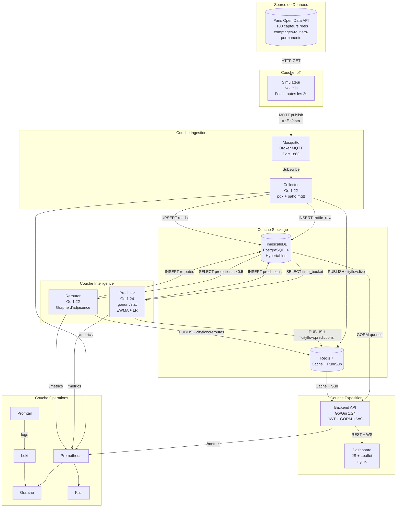
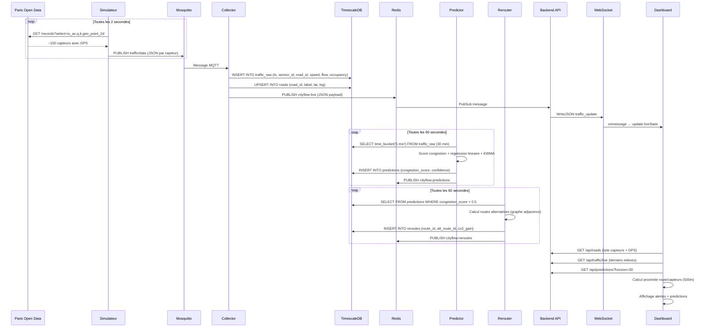
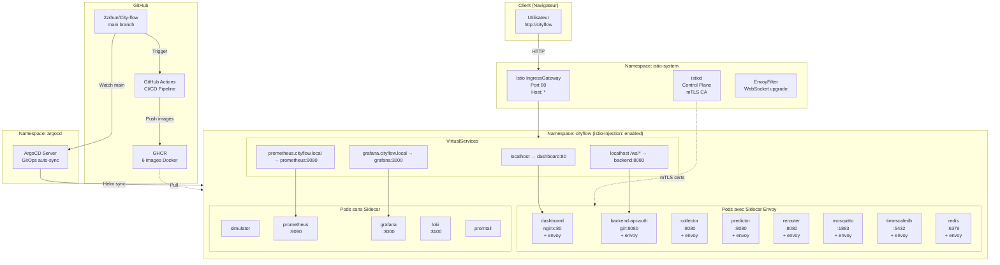
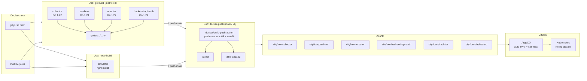
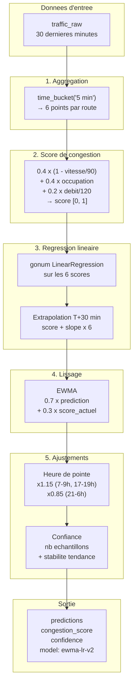
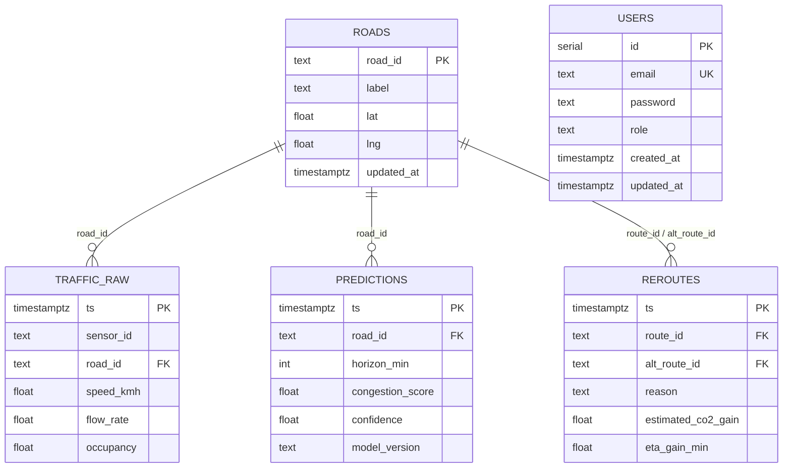
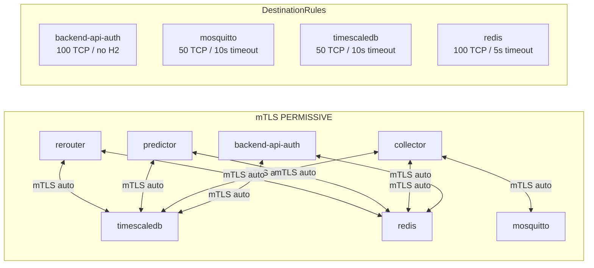

# CityFlow — Architecture Complete

## Vue d'ensemble

## Flux de donnees detaille

## Infrastructure Kubernetes + Istio

## Pipeline CI/CD

## Modele de prediction (ewma-lr-v2)

## Schema de la base de donnees

## Reseau Istio Service Mesh

## Stack par service

| Service | Langage | Framework | Base | Cache | Port | Dockerfile |
|---------|---------|-----------|------|-------|------|-----------|
| simulator | Node.js 20 | mqtt.js | — | — | — | `simulator/Dockerfile` |
| collector | Go 1.22 | pgx/v5, paho.mqtt | TimescaleDB | Redis pub | 8080 | `services/collector/Dockerfile` |
| predictor | Go 1.24 | pgx/v5, gonum/stat | TimescaleDB | Redis pub | 8080 | `services/predictor/Dockerfile` |
| rerouter | Go 1.22 | pgx/v5 | TimescaleDB | Redis pub | 8080 | `services/rerouter/Dockerfile` |
| backend-api-auth | Go 1.24 | Gin, GORM, gorilla/ws | TimescaleDB | Redis cache+sub | 8080 | `Backend_API_Auth/Dockerfile` |
| dashboard | JS | Leaflet, Leaflet Routing Machine | — | — | 80 | `services/dashboard/Dockerfile` |
