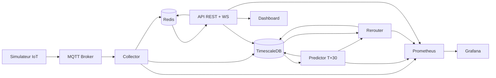

# CityFlow Analytics

CityFlow Analytics est un projet etudiant Smart City en temps reel:

- collecte de donnees trafic via MQTT (capteurs IoT simules)
- prediction de congestion a `T+30 min`
- proposition de reroutage pour reduire trafic et emissions
- visualisation live sur dashboard web
- deploiement conteneurise puis Kubernetes (`K3s`), avec GitOps (`ArgoCD`) en bonus

Objectif: livrer un MVP credible en 5 jours, sans budget cloud.

## 1) Vision et perimetre MVP

Perimetre MVP prioritaire:

1. Simulateur IoT -> MQTT
2. Service ingestion Go -> TimescaleDB
3. Service prediction Go (heuristique simple)
4. Service reroutage Go (regles)
5. API temps reel + WebSocket
6. Dashboard live (carte + graphes)
7. Deploiement K3s local

Fonctionnalites optionnelles (si temps restant):

- ArgoCD complet
- enrichissement meteo/evenements
- ~~Redis cache live~~ **fait**
- Istio service mesh

## 2) Architecture cible

Architecture en 5 couches:

1. **Couche source (IoT)**
- `simulator` (Node.js) emule des capteurs et publie sur MQTT.
- Entree: generation locale (aleatoire + scenarios de congestion).
- Sortie: messages JSON vers `cityflow/traffic/{sensor_id}`.

2. **Couche ingestion**
- `mqtt-broker` (Mosquitto) centralise les messages.
- `collector` (Go) consomme MQTT, valide, persiste dans TimescaleDB, et publie sur Redis (`cityflow:live`).
- Entree: topics MQTT.
- Sortie: table `traffic_raw` dans TimescaleDB + publication Redis pour le temps reel.

3. **Couche intelligence**
- `predictor` (Go) calcule la congestion `T+30`.
- `rerouter` (Go) propose des alternatives (ETA/CO2).
- Entree: historique `traffic_raw` + previsions.
- Sortie: tables `predictions` et `reroutes`.

4. **Couche exposition**
- `backend-api-auth` (Go/Gin) sert REST + WebSocket avec authentification JWT, cache Redis et pagination cursor.
- `dashboard` (OpenStreetMap + D3.js) affiche trafic, prediction, reroutage (a construire).
- Entree: TimescaleDB + Redis (pub/sub pour WebSocket).
- Sortie: vue operateur temps reel.

5. **Couche operations**
- `prometheus` collecte les metriques (`/metrics`).
- `grafana` visualise KPI techniques et metier.
- `ci/cd` build/test/push images.
- `k3s` orchestre les conteneurs.
- `argocd` (option J5) synchronise manifests Git -> cluster.

### Interfaces entre composants

| Source | Interface | Cible | But |
|---|---|---|---|
| simulator | MQTT | collector | Ingestion des mesures trafic |
| collector | SQL insert | TimescaleDB.traffic_raw | Stockage time-series |
| collector | Redis PUBLISH | Redis `cityflow:live` | Diffusion temps reel |
| predictor | SQL read/write | TimescaleDB.predictions | Prevision congestion T+30 |
| rerouter | SQL read/write | TimescaleDB.reroutes | Recommandations alternatives |
| api | SQL + Redis cache | DB + Redis | Agregation des donnees (cache 5-30s) |
| api | WebSocket | Redis SUBSCRIBE | Flux live via pub/sub |
| dashboard | REST + WebSocket | api | Affichage live operateur |
| services | HTTP `/metrics` | prometheus | Observabilite |

### Flux principal (ordre d execution)

1. `simulator -> mqtt-broker -> collector -> traffic_raw + Redis PUBLISH`
2. `predictor -> predictions` (a construire)
3. `rerouter -> reroutes` (a construire)
4. `api (REST + cache Redis + WS via Redis sub) -> dashboard`
5. `prometheus -> grafana`

### Diagramme (complement visuel)



## 3) Flux de donnees

1. Le simulateur publie des mesures trafic sur des topics MQTT.
2. `collector` consomme MQTT, valide les messages, ecrit en base et publie sur Redis (`cityflow:live`).
3. `predictor` lit des fenetres temporelles et produit des previsions `T+30` (a construire).
4. `rerouter` genere des alternatives si congestion > seuil (a construire).
5. `api` expose REST (avec cache Redis et pagination cursor) + WebSocket (via Redis pub/sub) au dashboard.
6. Prometheus scrape les metriques, Grafana affiche les KPI.

## 4) Schema de donnees (TimescaleDB)

Tables:

- `traffic_raw`: mesures capteurs (hypertable TimescaleDB)
- `predictions`: previsions congestion
- `reroutes`: recommandations generees
- `users`: comptes utilisateurs (auto-migree par GORM au demarrage de l'API)

Exemple SQL minimal:

```sql
CREATE TABLE IF NOT EXISTS traffic_raw (
  ts          TIMESTAMPTZ NOT NULL,
  sensor_id   TEXT        NOT NULL,
  road_id     TEXT        NOT NULL,
  speed_kmh   DOUBLE PRECISION,
  flow_rate   DOUBLE PRECISION,
  occupancy   DOUBLE PRECISION,
  PRIMARY KEY (ts, sensor_id)
);

SELECT create_hypertable('traffic_raw', 'ts', if_not_exists => TRUE);
CREATE INDEX IF NOT EXISTS idx_traffic_raw_road_ts ON traffic_raw (road_id, ts DESC);

CREATE TABLE IF NOT EXISTS predictions (
  ts               TIMESTAMPTZ NOT NULL,
  road_id          TEXT        NOT NULL,
  horizon_min      INT         NOT NULL DEFAULT 30,
  congestion_score DOUBLE PRECISION NOT NULL,
  confidence       DOUBLE PRECISION,
  model_version    TEXT        NOT NULL DEFAULT 'baseline-v1',
  PRIMARY KEY (ts, road_id, horizon_min)
);

CREATE TABLE IF NOT EXISTS reroutes (
  ts                 TIMESTAMPTZ NOT NULL,
  route_id           TEXT        NOT NULL,
  alt_route_id       TEXT        NOT NULL,
  reason             TEXT        NOT NULL,
  estimated_co2_gain DOUBLE PRECISION,
  eta_gain_min       DOUBLE PRECISION,
  PRIMARY KEY (ts, route_id, alt_route_id)
);
```

## 5) Topics MQTT (proposes)

- `cityflow/traffic/{sensor_id}`
- `cityflow/events/{type}` (option)

Payload JSON exemple:

```json
{
  "ts": "2026-02-09T10:00:00Z",
  "sensor_id": "S-042",
  "road_id": "RING-NORTH-12",
  "speed_kmh": 24.1,
  "flow_rate": 78.0,
  "occupancy": 0.82
}
```

## 6) Plan d execution en 5 jours

### Jour 1 - Ingestion et stockage

- Demarrer stack locale (`MQTT + TimescaleDB + Prometheus + Grafana`)
- Construire simulateur IoT Node.js
- Construire `collector` Go
- Verifier inserts dans `traffic_raw`

Done attendu:

- messages MQTT recus
- donnees persistees
- premier dashboard Grafana en ligne

### Jour 2 - Prediction T+30

- Construire `predictor` Go (cron interne 1-5 min)
- Implementer baseline simple (moyenne mobile + tendance)
- Ecrire dans `predictions`

Done attendu:

- previsions generees automatiquement
- metriques predictor dans Prometheus

### Jour 3 - Reroutage + API

- Construire `rerouter` Go (regles heuristiques)
- Ecrire dans `reroutes`
- Construire API/BFF (`REST + WebSocket`)

Done attendu:

- endpoints fonctionnels
- diffusion live cote WebSocket

### Jour 4 - Dashboard demo

- Carte OpenStreetMap
- Graphes D3.js (trafic live + previsions)
- Affichage recommandations reroutage

Done attendu:

- demo utilisateur de bout en bout

### Jour 5 - K3s + packaging final

- Deployer les services sur K3s
- Ajouter ArgoCD si possible
- Stabiliser README, scripts, procedure de demo

Done attendu:

- runbook clair
- demo reproductible

## 7) Lancement local (docker compose)

Prerequis:

- Docker Desktop + Compose
- `kubectl` (pour K3s)

Commandes types:

```bash
# 0) Variables d'environnement
cp .env.example .env

# 1) Build + start (tout dockerise)
docker compose up -d --build

# 2) Verifier les conteneurs
docker compose ps

# 3) Suivre les logs du simulateur
docker compose logs -f simulator

# 4) Suivre les logs du collector
docker compose logs -f collector

# 5) Suivre les logs de l'API auth
docker compose logs -f backend-api-auth
```

Tester l'API:

```bash
# Register
curl -X POST http://localhost:8081/api/auth/register \
  -H 'Content-Type: application/json' \
  -d '{"email":"test@cityflow.dev","password":"password123"}'

# Login et stocker le token
TOKEN=$(curl -s -X POST http://localhost:8081/api/auth/login \
  -H 'Content-Type: application/json' \
  -d '{"email":"test@cityflow.dev","password":"password123"}' | jq -r '.token')

# Trafic live (authentifie)
curl -H "Authorization: Bearer $TOKEN" http://localhost:8081/api/traffic/live?limit=5

# WebSocket temps reel
npx wscat -c "ws://localhost:8081/ws/live?token=$TOKEN"
```

Stop:

```bash
docker compose down
```

URLs locales:

- API auth: `http://localhost:8081/health`
- Collector metrics/health: `http://localhost:8080/metrics`, `http://localhost:8080/health`
- Grafana: `http://localhost:3000` (admin/admin par defaut)
- Prometheus: `http://localhost:9090`
- Loki: `http://localhost:3100`
- MQTT broker: `localhost:1883`
- TimescaleDB/Postgres: `localhost:5432`
- Redis: `localhost:6379`

## 8) Deploiement K3s (minimum)

Note: cette section en manifests bruts est conservee pour reference. Pour un setup propre,
utilise la section `8-bis` (ArgoCD + Helm).

1. Installer K3s local (ou VM Linux locale)
2. Construire/pusher images
3. Appliquer manifests:

```bash
kubectl apply -f k8s/namespaces
kubectl apply -f k8s/data
kubectl apply -f k8s/messaging
kubectl apply -f k8s/services
kubectl apply -f k8s/observability
```

4. Verifier:

```bash
kubectl get pods -A
kubectl get svc -A
```

## 8-bis) Workflow recommande: ArgoCD + Helm (cluster-first)

Objectif: piloter les deployments via GitOps des le depart.

### Arborescence ajoutee

- `charts/cityflow`: chart Helm de la stack MVP
- `argocd/project-cityflow.yaml`: AppProject ArgoCD
- `argocd/application-cityflow.yaml`: Application ArgoCD pointant sur le chart
- `scripts/bootstrap-k3s.sh`: install K3s (single node)
- `scripts/bootstrap-argocd.sh`: install ArgoCD + apply des manifests GitOps

### Etapes

1. Installer K3s (Linux/VM Linux):

```bash
./scripts/bootstrap-k3s.sh
```

2. Installer ArgoCD et enregistrer l'app CityFlow:

```bash
./scripts/bootstrap-argocd.sh
```

3. Ouvrir ArgoCD:

```bash
kubectl -n argocd port-forward svc/argocd-server 8081:443
kubectl -n argocd get secret argocd-initial-admin-secret -o jsonpath='{.data.password}' | base64 -d; echo
```

4. Adapter le repo Git cible:
- modifier `repoURL` dans `argocd/application-cityflow.yaml`
- verifier/adapter `charts/cityflow/values-prod.yaml`
- commit/push
- ArgoCD synchronise automatiquement

### Build/push images (important)

Le chart reference par defaut:
- `cityflow/collector:latest`
- `cityflow/simulator:latest`
- `cityflow/backend-api-auth:latest`

Avant sync ArgoCD, builder et pousser ces images dans un registry accessible par le cluster,
ou modifier `charts/cityflow/values.yaml` pour pointer vers tes images.

## 9) API (implementee)

### Authentification (JWT)

```
POST /api/auth/register          # Inscription (email + password, min 8 chars)
POST /api/auth/login             # Connexion -> retourne un token JWT
POST /api/auth/logout            # Deconnexion (JWT requis)
```

Reponse login/register:
```json
{
  "token": "eyJhbGci...",
  "user": {"id": 1, "email": "...", "role": "operator", "created_at": "..."}
}
```

### Endpoints donnees (JWT requis, cache Redis, pagination cursor)

```
GET /health                                    # Public, healthcheck
GET /api/traffic/live?limit=50&road_id=...     # Trafic live (cache 5s)
GET /api/predictions?horizon=30&limit=50       # Predictions (cache 30s)
GET /api/reroutes/recommended?limit=50         # Reroutages (cache 30s)
WS  /ws/live?token=<jwt>                       # WebSocket temps reel via Redis pub/sub
```

### Pagination cursor

Tous les endpoints GET de donnees supportent:
- `?limit=50` (defaut 50, max 200)
- `?before=<RFC3339>` (curseur pour page suivante)
- Reponse: `{"data": [...], "next_cursor": "...", "has_more": true}`

### Codes HTTP

- `200` succes (y compris resultats vides)
- `201` creation (register)
- `400` parametre invalide
- `401` token manquant/invalide
- `409` email deja enregistre
- `500` erreur serveur

## 10) KPI de demo

- latence ingestion (message MQTT -> DB)
- debit messages/s
- taux d erreur services
- congestion moyenne predite
- estimation gain CO2 (indicatif)

## 11) Risques et decisions techniques

- Pas de modele IA lourd: baseline explicable et robuste pour la soutenance.
- Pas d Istio dans le chemin critique: complexite trop elevee pour 5 jours.
- ArgoCD en bonus J5: priorite a un systeme fonctionnel de bout en bout.

## 12) Strategie de soutenance (recommandee)

1. Montrer architecture + flux en 1 minute.
2. Lancer simulateur et afficher flux live.
3. Montrer prediction T+30 et reroutage automatique.
4. Montrer Grafana (metriques techniques + metier).
5. Conclure avec limites et roadmap.

## 13) Prochaines ameliorations

- service `predictor` Go (congestion T+30, baseline heuristique)
- service `rerouter` Go (regles de reroutage)
- dashboard frontend (OpenStreetMap + D3.js)
- modele ML avance (XGBoost/LSTM)
- enrichissement meteo/evenements en production
- optimisation reseau multi-objectifs (ETA + CO2)
- GitOps complet + tests de charge
