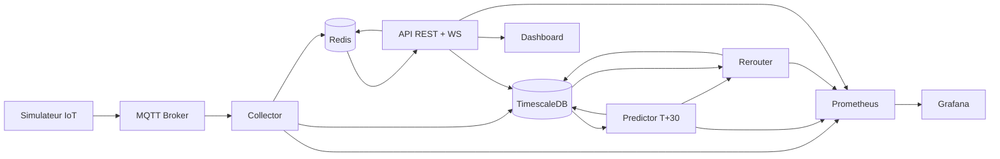

# CityFlow Analytics

CityFlow Analytics est un projet etudiant Smart City en temps reel:

- collecte de donnees trafic via MQTT (capteurs IoT simules)
- prediction de congestion a `T+30 min`
- proposition de reroutage pour reduire trafic et emissions
- visualisation live sur dashboard web
- deploiement conteneurise puis Kubernetes (`K3s`), avec GitOps (`ArgoCD`) en bonus

Objectif: livrer un MVP credible en 5 jours, sans budget cloud.

## 1) Vision et perimetre MVP

Perimetre MVP prioritaire:

1. Simulateur IoT -> MQTT
2. Service ingestion Go -> TimescaleDB
3. Service prediction Go (heuristique simple)
4. Service reroutage Go (regles)
5. API temps reel + WebSocket
6. Dashboard live (carte + graphes)
7. Deploiement K3s local

Fonctionnalites optionnelles (si temps restant):

- ~~ArgoCD complet~~ **fait** (GitOps avec auto-sync)
- enrichissement meteo/evenements
- ~~Redis cache live~~ **fait**
- Istio service mesh

## 2) Architecture cible

Architecture en 5 couches:

1. **Couche source (IoT)**
- `simulator` (Node.js) emule des capteurs et publie sur MQTT.
- Entree: generation locale (aleatoire + scenarios de congestion).
- Sortie: messages JSON vers `cityflow/traffic/{sensor_id}`.

2. **Couche ingestion**
- `mqtt-broker` (Mosquitto) centralise les messages.
- `collector` (Go) consomme MQTT, valide, persiste dans TimescaleDB, et publie sur Redis (`cityflow:live`).
- Entree: topics MQTT.
- Sortie: table `traffic_raw` dans TimescaleDB + publication Redis pour le temps reel.

3. **Couche intelligence**
- `predictor` (Go) calcule la congestion `T+30`.
- `rerouter` (Go) propose des alternatives (ETA/CO2).
- Entree: historique `traffic_raw` + previsions.
- Sortie: tables `predictions` et `reroutes`.

4. **Couche exposition**
- `backend-api-auth` (Go/Gin) sert REST + WebSocket avec authentification JWT, cache Redis et pagination cursor.
- `dashboard` (OpenStreetMap + D3.js) affiche trafic, prediction, reroutage (a construire).
- Entree: TimescaleDB + Redis (pub/sub pour WebSocket).
- Sortie: vue operateur temps reel.

5. **Couche operations**
- `prometheus` collecte les metriques (`/metrics`).
- `grafana` visualise KPI techniques et metier.
- `ci/cd` build/test/push images.
- `k3s` orchestre les conteneurs.
- `argocd` (option J5) synchronise manifests Git -> cluster.

### Interfaces entre composants

| Source | Interface | Cible | But |
|---|---|---|---|
| simulator | MQTT | collector | Ingestion des mesures trafic |
| collector | SQL insert | TimescaleDB.traffic_raw | Stockage time-series |
| collector | Redis PUBLISH | Redis `cityflow:live` | Diffusion temps reel |
| predictor | SQL read/write | TimescaleDB.predictions | Prevision congestion T+30 (score 0-1, toutes les 60s) |
| predictor | Redis PUBLISH | Redis `cityflow:predictions` | Diffusion temps reel des predictions |
| rerouter | SQL read (predictions) | TimescaleDB.predictions | Lecture des scores de congestion |
| rerouter | SQL write | TimescaleDB.reroutes | Recommandations alternatives (si congestion > 0.5) |
| rerouter | Redis PUBLISH | Redis `cityflow:reroutes` | Diffusion temps reel des recommandations |
| api | SQL + Redis cache | DB + Redis | Agregation des donnees (cache 5-30s) |
| api | WebSocket | Redis SUBSCRIBE | Flux live via pub/sub |
| dashboard | REST + WebSocket | api | Affichage live operateur |
| services | HTTP `/metrics` | prometheus | Observabilite |

### Flux principal (ordre d execution)

1. `simulator -> mqtt-broker -> collector -> traffic_raw + Redis PUBLISH`
2. `predictor -> predictions + Redis PUBLISH` (toutes les 60s, score de congestion par route)
3. `rerouter -> reroutes + Redis PUBLISH` (toutes les 60s, si congestion > 0.5 et alternative meilleure)
4. `api (REST + cache Redis + WS via Redis sub) -> dashboard`
5. `prometheus -> grafana`

### Diagramme (complement visuel)



## 3) Flux de donnees

1. Le simulateur publie des mesures trafic sur des topics MQTT.
2. `collector` consomme MQTT, valide les messages, ecrit en base et publie sur Redis (`cityflow:live`).
3. `predictor` lit les 30 dernieres minutes de `traffic_raw` par route, calcule un score de congestion (0-1) et ecrit dans `predictions`. Publie sur Redis (`cityflow:predictions`).
4. `rerouter` lit les predictions, detecte les routes congestionnees (score > 0.5), propose des alternatives via carte d'adjacence statique (2 alternatives par route). Publie sur Redis (`cityflow:reroutes`).
5. `api` expose REST (avec cache Redis et pagination cursor) + WebSocket (via Redis pub/sub) au dashboard.
6. Prometheus scrape les metriques, Grafana affiche les KPI.

## 4) Schema de donnees (TimescaleDB)

Tables:

- `traffic_raw`: mesures capteurs (hypertable TimescaleDB)
- `predictions`: previsions congestion (hypertable TimescaleDB, index sur `road_id, ts DESC`)
- `reroutes`: recommandations generees (hypertable TimescaleDB, index sur `route_id, ts DESC`)
- `users`: comptes utilisateurs (auto-migree par GORM au demarrage de l'API)

Exemple SQL minimal:

```sql
CREATE TABLE IF NOT EXISTS traffic_raw (
  ts          TIMESTAMPTZ NOT NULL,
  sensor_id   TEXT        NOT NULL,
  road_id     TEXT        NOT NULL,
  speed_kmh   DOUBLE PRECISION,
  flow_rate   DOUBLE PRECISION,
  occupancy   DOUBLE PRECISION,
  PRIMARY KEY (ts, sensor_id)
);

SELECT create_hypertable('traffic_raw', 'ts', if_not_exists => TRUE);
CREATE INDEX IF NOT EXISTS idx_traffic_raw_road_ts ON traffic_raw (road_id, ts DESC);

CREATE TABLE IF NOT EXISTS predictions (
  ts               TIMESTAMPTZ NOT NULL,
  road_id          TEXT        NOT NULL,
  horizon_min      INT         NOT NULL DEFAULT 30,
  congestion_score DOUBLE PRECISION NOT NULL,
  confidence       DOUBLE PRECISION,
  model_version    TEXT        NOT NULL DEFAULT 'baseline-v1',
  PRIMARY KEY (ts, road_id, horizon_min)
);

CREATE TABLE IF NOT EXISTS reroutes (
  ts                 TIMESTAMPTZ NOT NULL,
  route_id           TEXT        NOT NULL,
  alt_route_id       TEXT        NOT NULL,
  reason             TEXT        NOT NULL,
  estimated_co2_gain DOUBLE PRECISION,
  eta_gain_min       DOUBLE PRECISION,
  PRIMARY KEY (ts, route_id, alt_route_id)
);
```

## 5) Topics MQTT (proposes)

- `cityflow/traffic/{sensor_id}`
- `cityflow/events/{type}` (option)

Payload JSON exemple:

```json
{
  "ts": "2026-02-09T10:00:00Z",
  "sensor_id": "S-042",
  "road_id": "RING-NORTH-12",
  "speed_kmh": 24.1,
  "flow_rate": 78.0,
  "occupancy": 0.82
}
```

## 6) Plan d execution en 5 jours

### Jour 1 - Ingestion et stockage **FAIT**

- ~~Demarrer stack locale~~ **fait** (`MQTT + TimescaleDB + Prometheus + Grafana + Loki`)
- ~~Construire simulateur IoT Node.js~~ **fait** (10 capteurs, 5 routes, publication toutes les 2s)
- ~~Construire `collector` Go~~ **fait** (MQTT -> TimescaleDB + Redis pub/sub)
- ~~Verifier inserts dans `traffic_raw`~~ **fait**

Done attendu:

- messages MQTT recus **OK**
- donnees persistees **OK**
- premier dashboard Grafana en ligne **OK**

### Jour 2 - Prediction T+30 **FAIT**

- ~~Construire `predictor` Go (cron interne 1-5 min)~~ **fait** — boucle toutes les 60s
- ~~Implementer baseline simple (moyenne mobile + tendance)~~ **fait** — score pondere: 40% vitesse + 40% occupation + 20% debit
- ~~Ecrire dans `predictions`~~ **fait** — upsert avec ON CONFLICT
- Publication temps reel sur Redis `cityflow:predictions` **fait**

Done attendu:

- previsions generees automatiquement **OK**
- metriques predictor dans Prometheus **OK**

### Jour 3 - Reroutage + API **FAIT**

- ~~Construire `rerouter` Go (regles heuristiques)~~ **fait** — lit predictions, seuil 0.5, carte d'adjacence statique
- ~~Ecrire dans `reroutes`~~ **fait** — upsert avec ON CONFLICT, publication Redis `cityflow:reroutes`
- ~~Construire API/BFF (`REST + WebSocket`)~~ **fait** — JWT, cache Redis, pagination cursor, WebSocket

Done attendu:

- endpoints fonctionnels
- diffusion live cote WebSocket

### Jour 4 - Dashboard demo

- Carte OpenStreetMap
- Graphes D3.js (trafic live + previsions)
- Affichage recommandations reroutage

Done attendu:

- demo utilisateur de bout en bout

### Jour 5 - K3s + packaging final

- Deployer les services sur K3s
- Ajouter ArgoCD si possible
- Stabiliser README, scripts, procedure de demo

Done attendu:

- runbook clair
- demo reproductible

## 7) Lancement local (docker compose)

Prerequis:

- Docker Desktop + Compose
- `kubectl` (pour K3s)

Commandes types:

```bash
# 0) Variables d'environnement
cp .env.example .env

# 1) Build + start (tout dockerise)
docker compose up -d --build

# 2) Verifier les conteneurs
docker compose ps

# 3) Suivre les logs du simulateur
docker compose logs -f simulator

# 4) Suivre les logs du collector
docker compose logs -f collector

# 5) Suivre les logs de l'API auth
docker compose logs -f backend-api-auth
```

Tester l'API:

```bash
# Register
curl -X POST http://localhost:8081/api/auth/register \
  -H 'Content-Type: application/json' \
  -d '{"email":"test@cityflow.dev","password":"password123"}'

# Login et stocker le token
TOKEN=$(curl -s -X POST http://localhost:8081/api/auth/login \
  -H 'Content-Type: application/json' \
  -d '{"email":"test@cityflow.dev","password":"password123"}' | jq -r '.token')

# Trafic live (authentifie)
curl -H "Authorization: Bearer $TOKEN" http://localhost:8081/api/traffic/live?limit=5

# WebSocket temps reel
npx wscat -c "ws://localhost:8081/ws/live?token=$TOKEN"
```

Stop:

```bash
docker compose down
```

URLs locales:

- API auth: `http://localhost:8081/health`
- Collector metrics/health: `http://localhost:8080/metrics`, `http://localhost:8080/health`
- Predictor metrics/health: `http://localhost:8083/metrics`, `http://localhost:8083/health`
- Rerouter metrics/health: `http://localhost:8084/metrics`, `http://localhost:8084/health`
- Grafana: `http://localhost:3000` (admin/admin par defaut)
- Prometheus: `http://localhost:9090`
- Loki: `http://localhost:3100`
- MQTT broker: `localhost:1883`
- TimescaleDB/Postgres: `localhost:5432`
- Redis: `localhost:6379`

## 8) Deploiement Kubernetes (Docker Desktop + ArgoCD + Helm)

### Namespaces du cluster

| Namespace | Contenu | Role |
|-----------|---------|------|
| `cityflow` | 12 pods applicatifs (voir detail ci-dessous) | Stack CityFlow complete, deployee via Helm chart |
| `argocd` | 6 deployments ArgoCD (server, repo-server, app-controller, dex, redis, notifications) | GitOps — synchronise automatiquement le Helm chart depuis Git |
| `kube-system` | CoreDNS, kube-proxy, metrics-server, local-path-provisioner | Composants internes Kubernetes |
| `kube-node-lease` | Leases des noeuds | Heartbeat des noeuds (interne K8s) |
| `kube-public` | ConfigMaps publiques | Ressources accessibles a tous (interne K8s) |
| `local-path-storage` | Provisioner de volumes | Gestion automatique des PersistentVolumeClaims |
| `default` | Vide | Namespace par defaut (non utilise) |

### Namespace `cityflow` (detail)

| Pod | Type | Port | Role |
|-----|------|------|------|
| `mosquitto` | Deployment | 1883 | Broker MQTT — recoit les messages des capteurs IoT |
| `timescaledb` | Deployment | 5432 | Base de donnees time-series (PostgreSQL + TimescaleDB) |
| `redis` | Deployment | 6379 | Cache + pub/sub pour WebSocket temps reel |
| `collector` | Deployment | 8080 | Consomme MQTT, ecrit en DB, publie sur Redis |
| `predictor` | Deployment | 8080 | Calcule la congestion T+30 toutes les 60s, publie sur Redis |
| `rerouter` | Deployment | 8080 | Recommande des reroutages si congestion > 0.5, publie sur Redis |
| `simulator` | Deployment | — | Emule 10 capteurs IoT, publie sur MQTT toutes les 2s |
| `backend-api-auth` | Deployment | 8080 | API REST + JWT + WebSocket + cache Redis |
| `prometheus` | Deployment | 9090 | Collecte des metriques (`/metrics`) |
| `grafana` | Deployment | 3000 | Dashboards (metriques + logs) |
| `loki` | Deployment | 3100 | Agregation de logs |
| `promtail` | DaemonSet | — | Scrape les logs des pods et les envoie a Loki |

### Namespace `argocd` (detail)

| Deployment | Role |
|------------|------|
| `argocd-server` | UI web + API ArgoCD |
| `argocd-repo-server` | Clone les repos Git et genere les manifests Helm |
| `argocd-application-controller` | Compare l'etat desire (Git) vs l'etat reel (cluster) |
| `argocd-dex-server` | Authentification SSO (optionnel) |
| `argocd-redis` | Cache interne ArgoCD |
| `argocd-notifications-controller` | Notifications (Slack, webhooks, etc.) |

### Volumes persistants (PVC)

| PVC | Taille | Monte sur |
|-----|--------|-----------|
| `timescaledb-pvc` | 10Gi | `/var/lib/postgresql/data` |
| `redis-pvc` | 1Gi | `/data` |
| `prometheus-pvc` | 5Gi | `/prometheus` |
| `grafana-pvc` | 5Gi | `/var/lib/grafana` |
| `loki-pvc` | 5Gi | `/loki` |

### Arborescence K8s/GitOps

- `charts/cityflow/`: chart Helm de la stack MVP (source de verite)
- `argocd/project-cityflow.yaml`: AppProject ArgoCD
- `argocd/application-cityflow.yaml`: Application ArgoCD pointant sur `charts/cityflow/`
- `scripts/bootstrap-argocd.sh`: installe ArgoCD + applique les manifests GitOps
- `k8s/`: manifests bruts (reference, non utilises avec ArgoCD)

### Setup du cluster

Prerequis: Docker Desktop avec Kubernetes active.

```bash
# 1) Verifier le contexte
kubectl config use-context docker-desktop
kubectl get nodes

# 2) Installer Helm
brew install helm

# 3) Build et push des images vers GHCR
echo $CR_PAT | docker login ghcr.io -u 2zrhun --password-stdin

docker build --platform linux/arm64 -t ghcr.io/2zrhun/cityflow-collector:latest -f services/collector/Dockerfile services/collector/
docker push ghcr.io/2zrhun/cityflow-collector:latest

docker build --platform linux/arm64 -t ghcr.io/2zrhun/cityflow-predictor:latest -f services/predictor/Dockerfile services/predictor/
docker push ghcr.io/2zrhun/cityflow-predictor:latest

docker build --platform linux/arm64 -t ghcr.io/2zrhun/cityflow-rerouter:latest -f services/rerouter/Dockerfile services/rerouter/
docker push ghcr.io/2zrhun/cityflow-rerouter:latest

docker build --platform linux/arm64 -t ghcr.io/2zrhun/cityflow-backend-api-auth:latest -f Backend_API_Auth/Dockerfile Backend_API_Auth/
docker push ghcr.io/2zrhun/cityflow-backend-api-auth:latest

docker build --platform linux/arm64 -t ghcr.io/2zrhun/cityflow-simulator:latest -f simulator/Dockerfile simulator/
docker push ghcr.io/2zrhun/cityflow-simulator:latest

# 4) Installer ArgoCD et deployer
./scripts/bootstrap-argocd.sh
```

### Acces aux services (port-forward)

```bash
# API
kubectl -n cityflow port-forward svc/backend-api-auth 8081:8080

# Predictor
kubectl -n cityflow port-forward svc/predictor 8083:8080

# Rerouter
kubectl -n cityflow port-forward svc/rerouter 8084:8080

# ArgoCD UI (https://localhost:8443, admin + mot de passe ci-dessous)
kubectl -n argocd port-forward svc/argocd-server 8443:443
kubectl -n argocd get secret argocd-initial-admin-secret -o jsonpath='{.data.password}' | base64 -d; echo

# Grafana (http://localhost:3000, admin/admin)
kubectl -n cityflow port-forward svc/grafana 3000:3000

# Prometheus (http://localhost:9090)
kubectl -n cityflow port-forward svc/prometheus 9090:9090
```

### GitOps: deploiement automatique

ArgoCD surveille la branche `main` du repo `https://github.com/2zrhun/City-flow.git`,
dossier `charts/cityflow/`. Tout push sur ce dossier declenche un sync automatique:

- `syncPolicy.automated.prune: true` — supprime les ressources retirees du chart
- `syncPolicy.automated.selfHeal: true` — re-synchronise si un changement manuel est detecte

Images GHCR (configurees dans `values-prod.yaml`):
- `ghcr.io/2zrhun/cityflow-collector:latest`
- `ghcr.io/2zrhun/cityflow-predictor:latest`
- `ghcr.io/2zrhun/cityflow-rerouter:latest`
- `ghcr.io/2zrhun/cityflow-backend-api-auth:latest`
- `ghcr.io/2zrhun/cityflow-simulator:latest`

## 9) API (implementee)

### Authentification (JWT)

```
POST /api/auth/register          # Inscription (email + password, min 8 chars)
POST /api/auth/login             # Connexion -> retourne un token JWT
POST /api/auth/logout            # Deconnexion (JWT requis)
```

Reponse login/register:
```json
{
  "token": "eyJhbGci...",
  "user": {"id": 1, "email": "...", "role": "operator", "created_at": "..."}
}
```

### Endpoints donnees (JWT requis, cache Redis, pagination cursor)

```
GET /health                                    # Public, healthcheck
GET /api/traffic/live?limit=50&road_id=...     # Trafic live (cache 5s)
GET /api/predictions?horizon=30&limit=50       # Predictions (cache 30s)
GET /api/reroutes/recommended?limit=50         # Reroutages (cache 30s)
WS  /ws/live?token=<jwt>                       # WebSocket temps reel via Redis pub/sub
```

### Pagination cursor

Tous les endpoints GET de donnees supportent:
- `?limit=50` (defaut 50, max 200)
- `?before=<RFC3339>` (curseur pour page suivante)
- Reponse: `{"data": [...], "next_cursor": "...", "has_more": true}`

### Codes HTTP

- `200` succes (y compris resultats vides)
- `201` creation (register)
- `400` parametre invalide
- `401` token manquant/invalide
- `409` email deja enregistre
- `500` erreur serveur

## 10) KPI de demo

- latence ingestion (message MQTT -> DB)
- debit messages/s
- taux d erreur services
- congestion moyenne predite
- estimation gain CO2 (indicatif)

## 11) Risques et decisions techniques

- Pas de modele IA lourd: baseline explicable et robuste pour la soutenance.
- Pas d Istio dans le chemin critique: complexite trop elevee pour 5 jours.
- ArgoCD en bonus J5: priorite a un systeme fonctionnel de bout en bout.

## 12) Strategie de soutenance (recommandee)

1. Montrer architecture + flux en 1 minute.
2. Lancer simulateur et afficher flux live.
3. Montrer prediction T+30 et reroutage automatique.
4. Montrer Grafana (metriques techniques + metier).
5. Conclure avec limites et roadmap.

## 13) Prochaines ameliorations

- dashboard frontend (OpenStreetMap + D3.js)
- CI/CD pipeline (GitHub Actions: build, test, push images)
- modele ML avance (XGBoost/LSTM) pour remplacer le baseline heuristique
- enrichissement meteo/evenements en production
- optimisation reseau multi-objectifs (ETA + CO2)
- tests de charge
