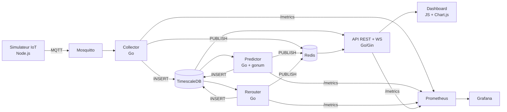

# CityFlow Analytics

Plateforme Smart City temps reel de monitoring du trafic urbain : ingestion IoT, prediction de congestion a T+30 min par machine learning, reroutage automatique et dashboard operateur live.

Projet etudiant — MVP livre en 5 jours, zero budget cloud.

## Architecture



**5 couches** : Source IoT → Ingestion → Intelligence → Exposition → Operations

| Couche | Composants | Role |
|--------|-----------|------|
| Source IoT | `simulator` (Node.js) | 10 capteurs, 5 routes Paris, publication MQTT toutes les 2s |
| Ingestion | `mosquitto` + `collector` (Go) | Broker MQTT → validation → TimescaleDB + Redis pub/sub |
| Intelligence | `predictor` (Go + gonum) + `rerouter` (Go) | Prediction T+30 (EWMA + regression lineaire) + reroutage si congestion > 0.5 |
| Exposition | `backend-api-auth` (Go/Gin) + `dashboard` (JS) | REST + WebSocket + JWT + cache Redis + carte SVG temps reel |
| Operations | Prometheus + Grafana + Loki/Promtail | Metriques, logs, dashboards + CI/CD GitHub Actions |

## Stack technique

| Composant | Technologie | Version |
|-----------|------------|---------|
| Simulateur | Node.js, mqtt.js | 20.x |
| Collector | Go, pgx/v5, paho.mqtt, go-redis | 1.22 |
| Predictor | Go, pgx/v5, gonum/stat, go-redis | 1.24 |
| Rerouter | Go, pgx/v5, go-redis | 1.22 |
| API | Go, Gin, GORM, JWT, go-redis, gorilla/websocket | 1.24 |
| Dashboard | vanilla JS, Chart.js, nginx | — |
| Base de donnees | TimescaleDB (PostgreSQL 16) | latest-pg16 |
| Broker MQTT | Eclipse Mosquitto | 2.x |
| Cache / Pub-Sub | Redis Alpine | 7.x |
| Observabilite | Prometheus, Grafana, Loki, Promtail | latest / 2.9.8 |
| Orchestration | Docker Compose / Kubernetes / ArgoCD + Helm | — |
| CI/CD | GitHub Actions → GHCR | — |

## Modele de prediction (ewma-lr-v2)

Le predictor calcule un score de congestion `[0, 1]` par route toutes les 60 secondes :

1. **Aggregation temporelle** — `time_bucket('5 minutes')` sur les 30 dernieres minutes (6 points par route)
2. **Score de congestion** — `0.4 × (1 - vitesse/90) + 0.4 × occupation + 0.2 × debit/120`
3. **Regression lineaire** (gonum) — tendance sur la serie temporelle des scores
4. **Extrapolation** — projection du score a T+30 min
5. **Lissage EWMA** — `0.7 × prediction + 0.3 × score_actuel`
6. **Facteur heure de pointe** — ×1.15 (7-9h, 17-19h) / ×0.85 (21-6h)
7. **Confiance** — basee sur le nombre d'echantillons et la stabilite de la tendance

## Lancement rapide

### Prerequis

- Docker Desktop + Compose

### Demarrage

```bash
# 1) Configurer les variables d'environnement
cp .env.example .env

# 2) Build + start de toute la stack
docker compose up -d --build

# 3) Verifier
docker compose ps

# 4) Suivre les logs
docker compose logs -f simulator collector predictor rerouter
```

### Tester l'API

```bash
# Inscription
curl -X POST http://localhost:8081/api/auth/register \
  -H 'Content-Type: application/json' \
  -d '{"email":"test@cityflow.dev","password":"password123"}'

# Connexion
TOKEN=$(curl -s -X POST http://localhost:8081/api/auth/login \
  -H 'Content-Type: application/json' \
  -d '{"email":"test@cityflow.dev","password":"password123"}' | jq -r '.token')

# Trafic live
curl -H "Authorization: Bearer $TOKEN" http://localhost:8081/api/traffic/live?limit=5

# Predictions
curl -H "Authorization: Bearer $TOKEN" http://localhost:8081/api/predictions?limit=5

# Reroutages
curl -H "Authorization: Bearer $TOKEN" http://localhost:8081/api/reroutes/recommended?limit=5

# WebSocket temps reel
npx wscat -c "ws://localhost:8081/ws/live?token=$TOKEN"
```

### Arret

```bash
docker compose down
```

## URLs locales

| URL | Service |
|-----|---------|
| `http://localhost:3001` | Dashboard (login puis vue operateur) |
| `http://localhost:8081/health` | API Backend |
| `http://localhost:8080/health` | Collector |
| `http://localhost:8083/health` | Predictor |
| `http://localhost:8084/health` | Rerouter |
| `http://localhost:3000` | Grafana (admin/admin) |
| `http://localhost:9090` | Prometheus |
| `localhost:1883` | MQTT Broker |
| `localhost:5432` | TimescaleDB |
| `localhost:6379` | Redis |

## API

### Authentification (JWT)

| Methode | Endpoint | Auth | Description |
|---------|----------|------|-------------|
| POST | `/api/auth/register` | Public | Inscription (email + password, min 8 chars) |
| POST | `/api/auth/login` | Public | Connexion → token JWT |
| POST | `/api/auth/logout` | JWT | Deconnexion |

### Donnees (JWT requis, cache Redis, pagination cursor)

| Methode | Endpoint | Cache | Description |
|---------|----------|-------|-------------|
| GET | `/api/traffic/live` | 5s | Mesures trafic temps reel |
| GET | `/api/predictions?horizon=30` | 30s | Predictions de congestion |
| GET | `/api/reroutes/recommended` | 30s | Recommandations de reroutage |
| WS | `/ws/live?token=<jwt>` | — | Flux WebSocket temps reel via Redis pub/sub |
| GET | `/health` | — | Healthcheck (public) |

**Pagination cursor** : `?limit=50&before=<RFC3339>&road_id=<id>` → `{"data": [...], "next_cursor": "...", "has_more": true}`

## Schema de donnees (TimescaleDB)

```sql
-- Mesures capteurs (hypertable)
traffic_raw (ts, sensor_id, road_id, speed_kmh, flow_rate, occupancy)

-- Predictions congestion (hypertable)
predictions (ts, road_id, horizon_min, congestion_score, confidence, model_version)

-- Recommandations reroutage (hypertable)
reroutes (ts, route_id, alt_route_id, reason, estimated_co2_gain, eta_gain_min)

-- Utilisateurs (GORM auto-migrate)
users (id, email, password, role, created_at, updated_at)
```

## Tests

```bash
# Tests unitaires Go (41 tests au total)
cd services/collector && go test -v ./...     # 7 tests
cd services/predictor && go test -v ./...     # 16 tests
cd services/rerouter && go test -v ./...      # 8 tests
cd Backend_API_Auth && go test -v ./...       # 10 tests
```

Les tests couvrent : parsing JSON, algorithmes ML (EWMA, regression lineaire, rush hour), logique de reroutage, configuration, JWT, bcrypt.

## CI/CD

Pipeline GitHub Actions (`.github/workflows/ci.yml`) :

1. **Build & Test** — compile et execute les tests pour les 4 services Go (matrix)
2. **Docker Push** — build multi-arch (amd64 + arm64) et push vers GHCR

Images : `ghcr.io/2zrhun/cityflow-{collector,predictor,rerouter,backend-api-auth,simulator,dashboard}:latest`

## Deploiement Kubernetes

### Prerequis

- Docker Desktop avec Kubernetes active
- Helm (`brew install helm`)

### Installation

```bash
# Verifier le contexte
kubectl config use-context docker-desktop

# Installer ArgoCD + deployer la stack
./scripts/bootstrap-argocd.sh
```

### Acces aux services

```bash
kubectl -n cityflow port-forward svc/dashboard 3001:80
kubectl -n cityflow port-forward svc/backend-api-auth 8081:8080
kubectl -n cityflow port-forward svc/grafana 3000:3000
kubectl -n argocd port-forward svc/argocd-server 8443:443
```

### GitOps

ArgoCD surveille `main` → `charts/cityflow/`. Tout push declenche un sync automatique avec auto-prune et self-heal.

### Pods (namespace `cityflow`)

| Pod | Role | Port |
|-----|------|------|
| mosquitto | Broker MQTT | 1883 |
| timescaledb | Base time-series | 5432 |
| redis | Cache + pub/sub | 6379 |
| collector | Ingestion MQTT → DB | 8080 |
| predictor | Prediction T+30 | 8080 |
| rerouter | Reroutage | 8080 |
| simulator | Emulation capteurs | — |
| backend-api-auth | API REST + WS | 8080 |
| dashboard | Frontend web | 80 |
| prometheus | Metriques | 9090 |
| grafana | Dashboards | 3000 |
| loki | Logs | 3100 |
| promtail | Collecte logs | — |

## Structure du projet

```
City-flow/
├── Backend_API_Auth/         # API REST + JWT + WebSocket (Go/Gin)
│   ├── cmd/api/              # Entrypoint
│   ├── config/               # Configuration + tests
│   ├── models/               # Modeles GORM
│   ├── handlers/             # Handlers HTTP
│   ├── middleware/            # JWT + CORS
│   ├── services/             # Auth + cache + tests
│   └── Migrations/           # Migrations SQL
├── services/
│   ├── collector/            # Ingestion MQTT → DB + tests
│   ├── predictor/            # Prediction ML (EWMA+LR) + tests
│   ├── rerouter/             # Reroutage + tests
│   └── dashboard/            # Frontend JS + nginx
├── simulator/                # Simulateur IoT Node.js
├── ops/                      # Configs infra (Mosquitto, Prometheus, Loki, Grafana, TimescaleDB)
├── charts/cityflow/          # Helm chart complet
├── argocd/                   # Manifests GitOps
├── scripts/                  # Scripts bootstrap
├── .github/workflows/        # CI/CD GitHub Actions
├── docker-compose.yml        # Stack locale complete
└── .env.example              # Template variables d'environnement
```

## Equipe

| Membre | Role | Responsabilites |
|--------|------|----------------|
| Hamza | AdminSys / Infra | Infrastructure, CI/CD, deploiement, observabilite, securite |
| Walid | Dev Backend | API, services Go, base de donnees, logique metier |
| Hugo | Dev Frontend / UX | Dashboard, integration front, QA fonctionnelle |
