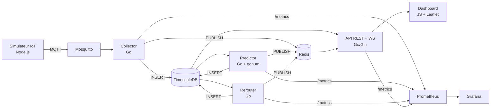

# CityFlow Analytics

Plateforme Smart City temps reel de monitoring du trafic urbain : ingestion de donnees IoT depuis l'Open Data Paris (~100 capteurs reels), prediction de congestion a T+30 min par machine learning, reroutage automatique et dashboard operateur live avec carte interactive Leaflet.

Projet etudiant — MVP livre en 5 jours, zero budget cloud.

## Architecture



**5 couches** : Source IoT → Ingestion → Intelligence → Exposition → Operations

| Couche | Composants | Role |
|--------|-----------|------|
| Source IoT | `simulator` (Node.js) | ~100 capteurs reels Paris Open Data, publication MQTT toutes les 2s |
| Ingestion | `mosquitto` + `collector` (Go) | Broker MQTT → validation → TimescaleDB + Redis pub/sub + upsert metadonnees routes |
| Intelligence | `predictor` (Go + gonum) + `rerouter` (Go) | Prediction T+30 (EWMA + regression lineaire) + reroutage si congestion > 0.5 |
| Exposition | `backend-api-auth` (Go/Gin) + `dashboard` (JS/Leaflet) | REST + WebSocket + JWT + cache Redis + carte interactive + navigation |
| Operations | Prometheus + Grafana + Loki/Promtail | Metriques, logs, dashboards + CI/CD GitHub Actions |

## Source de donnees : Paris Open Data

Le simulateur interroge l'API **Paris Open Data** (`comptages-routiers-permanents`) en temps reel pour recuperer les donnees de ~100 capteurs de comptage routier repartis sur tout Paris :

- **API** : `https://opendata.paris.fr/api/explore/v2.1/catalog/datasets/comptages-routiers-permanents/records`
- **Champs utilises** : `iu_ac` (ID capteur), `libelle` (nom de rue), `q` (debit vehicules/h), `k` (taux d'occupation), `etat_trafic`, `geo_point_2d` (lat/lng)
- **Transformation** : chaque capteur devient une route `PARIS-{iu_ac}` avec coordonnees GPS, vitesse estimee depuis le debit/occupation, et label de rue
- **Fallback** : si l'API est indisponible, le simulateur genere des donnees synthetiques pour 5 routes `SIM-*`

Les coordonnees GPS sont propagees dans le payload MQTT et stockees dans la table `roads` par le collector, permettant au dashboard d'afficher dynamiquement tous les capteurs sur la carte.

## Stack technique

| Composant | Technologie | Version |
|-----------|------------|---------|
| Simulateur | Node.js, mqtt.js, Paris Open Data API | 20.x |
| Collector | Go, pgx/v5, paho.mqtt, go-redis | 1.22 |
| Predictor | Go, pgx/v5, gonum/stat, go-redis | 1.24 |
| Rerouter | Go, pgx/v5, go-redis | 1.22 |
| API | Go, Gin, GORM, JWT, go-redis, gorilla/websocket | 1.24 |
| Dashboard | vanilla JS, Leaflet, Leaflet Routing Machine, nginx | — |
| Base de donnees | TimescaleDB (PostgreSQL 16) | latest-pg16 |
| Broker MQTT | Eclipse Mosquitto | 2.x |
| Cache / Pub-Sub | Redis Alpine | 7.x |
| Service Mesh | Istio (demo profile) | 1.28 |
| Observabilite | Prometheus, Grafana, Loki, Promtail, Kiali | latest / 2.9.8 |
| Orchestration | Kubernetes (Docker Desktop) + Helm + ArgoCD | — |
| CI/CD | GitHub Actions → GHCR | — |

## Modele de prediction (ewma-lr-v2)

Le predictor calcule un score de congestion `[0, 1]` par route toutes les 60 secondes :

1. **Aggregation temporelle** — `time_bucket('5 minutes')` sur les 30 dernieres minutes (6 points par route)
2. **Score de congestion** — `0.4 x (1 - vitesse/90) + 0.4 x occupation + 0.2 x debit/120`
3. **Regression lineaire** (gonum) — tendance sur la serie temporelle des scores
4. **Extrapolation** — projection du score a T+30 min
5. **Lissage EWMA** — `0.7 x prediction + 0.3 x score_actuel`
6. **Facteur heure de pointe** — x1.15 (7-9h, 17-19h) / x0.85 (21-6h)
7. **Confiance** — basee sur le nombre d'echantillons et la stabilite de la tendance

## Dashboard operateur

Le dashboard est une SPA vanilla JS avec carte Leaflet :

- **Carte interactive** : fond CartoDB dark, zoom sur Paris, curseur crosshair pour selection de points
- **Navigation** : saisie d'adresses avec autocompletion Nominatim ou clic sur la carte, calcul d'itineraires via OSRM (driving), affichage de routes alternatives
- **Integration trafic** : detection automatique des capteurs proches de la route (rayon 500m), alertes congestion en temps reel, predictions a +30min pour chaque capteur proche
- **Estimation CO2** : calcul par route basee sur la distance et la vitesse moyenne, badge "Eco" pour la route la moins polluante
- **WebSocket live** : mise a jour en temps reel des etats de trafic via Redis pub/sub
- **Authentification** : login/register avec JWT, deconnexion

## Lancement rapide

### Docker Compose (developpement local)

```bash
# 1) Configurer les variables d'environnement
cp .env.example .env

# 2) Build + start de toute la stack (14 services)
docker compose up -d --build

# 3) Verifier
docker compose ps

# 4) Suivre les logs
docker compose logs -f simulator collector predictor rerouter
```

### Tester l'API

```bash
# Inscription
curl -X POST http://localhost:8081/api/auth/register \
  -H 'Content-Type: application/json' \
  -d '{"email":"test@cityflow.dev","password":"password123"}'

# Connexion
TOKEN=$(curl -s -X POST http://localhost:8081/api/auth/login \
  -H 'Content-Type: application/json' \
  -d '{"email":"test@cityflow.dev","password":"password123"}' | jq -r '.token')

# Trafic live
curl -H "Authorization: Bearer $TOKEN" http://localhost:8081/api/traffic/live?limit=5

# Predictions
curl -H "Authorization: Bearer $TOKEN" http://localhost:8081/api/predictions?limit=5

# Routes (metadonnees avec coordonnees GPS)
curl -H "Authorization: Bearer $TOKEN" http://localhost:8081/api/roads

# Reroutages
curl -H "Authorization: Bearer $TOKEN" http://localhost:8081/api/reroutes/recommended?limit=5

# WebSocket temps reel
npx wscat -c "ws://localhost:8081/ws/live?token=$TOKEN"
```

### Arret

```bash
docker compose down
```

## URLs locales

### Docker Compose

| URL | Service |
|-----|---------|
| `http://localhost:3001` | Dashboard (login puis vue operateur) |
| `http://localhost:8081/health` | API Backend |
| `http://localhost:8080/health` | Collector |
| `http://localhost:8083/health` | Predictor |
| `http://localhost:8084/health` | Rerouter |
| `http://localhost:3000` | Grafana (admin/admin) |
| `http://localhost:9090` | Prometheus |
| `localhost:1883` | MQTT Broker |
| `localhost:5432` | TimescaleDB |
| `localhost:6379` | Redis |

### Kubernetes + Istio

| URL | Service | Methode d'acces |
|-----|---------|----------------|
| `http://localhost` | Dashboard | Istio IngressGateway |
| `http://grafana.cityflow.local` | Grafana (admin/admin) | Istio VirtualService + /etc/hosts |
| `http://argocd.cityflow.local` | ArgoCD | Istio VirtualService + /etc/hosts |
| `http://kiali.cityflow.local` | Kiali | Istio VirtualService + /etc/hosts |
| `http://prometheus.cityflow.local` | Prometheus | Istio VirtualService + /etc/hosts |

## API

### Authentification (JWT)

| Methode | Endpoint | Auth | Description |
|---------|----------|------|-------------|
| POST | `/api/auth/register` | Public | Inscription (email + password, min 8 chars) |
| POST | `/api/auth/login` | Public | Connexion → token JWT (24h) |
| POST | `/api/auth/logout` | JWT | Deconnexion |

### Donnees (JWT requis, cache Redis, pagination cursor)

| Methode | Endpoint | Cache | Description |
|---------|----------|-------|-------------|
| GET | `/api/traffic/live` | 5s | Mesures trafic temps reel |
| GET | `/api/predictions?horizon=30` | 30s | Predictions de congestion |
| GET | `/api/roads` | 60s | Liste des routes avec coordonnees GPS |
| GET | `/api/reroutes/recommended` | 30s | Recommandations de reroutage |
| WS | `/ws/live?token=<jwt>` | — | Flux WebSocket temps reel via Redis pub/sub |
| GET | `/health` | — | Healthcheck (public) |

**Pagination cursor** : `?limit=50&before=<RFC3339>&road_id=<id>` → `{"data": [...], "next_cursor": "...", "has_more": true}`

## Schema de donnees (TimescaleDB)

```sql
-- Mesures capteurs (hypertable, partitionnee par temps)
traffic_raw (ts, sensor_id, road_id, speed_kmh, flow_rate, occupancy)

-- Predictions congestion (hypertable)
predictions (ts, road_id, horizon_min, congestion_score, confidence, model_version)

-- Recommandations reroutage (hypertable)
reroutes (ts, route_id, alt_route_id, reason, estimated_co2_gain, eta_gain_min)

-- Metadonnees routes (table standard, upsert par le collector)
roads (road_id TEXT PK, label TEXT, lat DOUBLE PRECISION, lng DOUBLE PRECISION, updated_at TIMESTAMPTZ)

-- Utilisateurs (GORM auto-migrate)
users (id, email, password, role, created_at, updated_at)
```

## Tests

```bash
# Tests unitaires Go (41 tests au total)
cd services/collector && go test -v ./...     # 7 tests
cd services/predictor && go test -v ./...     # 16 tests
cd services/rerouter && go test -v ./...      # 8 tests
cd Backend_API_Auth && go test -v ./...       # 10 tests
```

Les tests couvrent : parsing JSON, algorithmes ML (EWMA, regression lineaire, rush hour), logique de reroutage, configuration, JWT, bcrypt.

## CI/CD

### Pipeline GitHub Actions

Le fichier `.github/workflows/ci.yml` definit un pipeline en 3 jobs :

```
Push/PR sur main
       |
       v
  +-----------+     +------------+
  | go-build  |     | node-build |
  | (matrix)  |     | (simulator)|
  +-----------+     +------------+
       |                  |
       v                  v
   Tests OK ?        npm install OK ?
       |                  |
       +--------+---------+
                |
                v
         +-----------+
         |docker-push|  (seulement sur push main)
         | (matrix)  |
         +-----------+
                |
                v
          Push GHCR
           6 images
```

### Job 1 : `go-build` (Build & Test des services Go)

Execute en parallele via une **strategy matrix** pour les 4 services Go :

| Service | Repertoire | Go version |
|---------|-----------|------------|
| collector | `services/collector` | 1.22 |
| predictor | `services/predictor` | 1.24 |
| rerouter | `services/rerouter` | 1.22 |
| backend-api-auth | `Backend_API_Auth` | 1.24 |

**Etapes pour chaque service :**
1. `actions/checkout@v4` — clone le repo
2. `actions/setup-go@v5` — installe Go avec cache des dependencies (`go.sum`)
3. `go mod download` — telecharge les modules
4. `CGO_ENABLED=0 go build ./...` — compile statiquement (zero dependency C)
5. `go test ./... -v -count=1` — execute tous les tests unitaires sans cache

### Job 2 : `node-build` (Validation du simulateur)

1. `actions/setup-node@v4` — installe Node.js 20
2. `npm install` — verifie que les dependencies s'installent correctement

### Job 3 : `docker-push` (Build & Push des images Docker)

**Conditions d'execution :**
- Depend de `go-build` et `node-build` (les deux doivent reussir)
- Execute **uniquement** sur push vers `main` (pas sur les PR)

**Strategy matrix** : 6 images en parallele (`fail-fast: false`)

| Image | Contexte | Dockerfile |
|-------|----------|-----------|
| `cityflow-collector` | `services/collector` | `services/collector/Dockerfile` |
| `cityflow-predictor` | `services/predictor` | `services/predictor/Dockerfile` |
| `cityflow-rerouter` | `services/rerouter` | `services/rerouter/Dockerfile` |
| `cityflow-backend-api-auth` | `Backend_API_Auth` | `Backend_API_Auth/Dockerfile` |
| `cityflow-simulator` | `simulator` | `simulator/Dockerfile` |
| `cityflow-dashboard` | `services/dashboard` | `services/dashboard/Dockerfile` |

**Etapes pour chaque image :**
1. `docker/login-action@v3` — authentification GHCR avec le secret `CR_PAT`
2. `docker/setup-buildx-action@v3` — active BuildKit pour build multi-architecture
3. `docker/build-push-action@v6` — build et push avec :
   - **Plateformes** : `linux/amd64` + `linux/arm64` (compatible x86 et Apple Silicon)
   - **Tags** : `:latest` + `:${GITHUB_SHA}` (versioning par commit)
   - **Labels OCI** : source repo + description
   - **Cache** : GitHub Actions cache (`type=gha`) pour accelerer les builds incrementaux

### Images produites

```
ghcr.io/2zrhun/cityflow-collector:latest
ghcr.io/2zrhun/cityflow-predictor:latest
ghcr.io/2zrhun/cityflow-rerouter:latest
ghcr.io/2zrhun/cityflow-backend-api-auth:latest
ghcr.io/2zrhun/cityflow-simulator:latest
ghcr.io/2zrhun/cityflow-dashboard:latest
```

Chaque image est egalement taguee avec le SHA du commit (`ghcr.io/2zrhun/cityflow-*:<sha>`), permettant un rollback precis.

### Secrets requis

| Secret | Description |
|--------|------------|
| `CR_PAT` | GitHub Personal Access Token avec scope `write:packages` pour push GHCR |

### Flux complet CI/CD → GitOps

```
Developpeur push sur main
        |
        v
  GitHub Actions CI
  (build, test, push images)
        |
        v
  Images sur GHCR (:latest + :sha)
        |
        v
  ArgoCD detecte le changement
  (sync auto, self-heal, auto-prune)
        |
        v
  Kubernetes rolling update
  (imagePullPolicy: Always)
        |
        v
  Pods mis a jour dans le namespace cityflow
```

## Deploiement Kubernetes

### Prerequis

- Docker Desktop avec Kubernetes active
- Helm (`brew install helm`)
- (Optionnel) Istio CLI (`istioctl`)

### Installation

```bash
# Verifier le contexte
kubectl config use-context docker-desktop

# Installer ArgoCD + deployer la stack
./scripts/bootstrap-argocd.sh
```

Le script `bootstrap-argocd.sh` :
1. Cree le namespace `argocd`
2. Installe ArgoCD depuis les manifests officiels
3. Attend que le serveur ArgoCD soit pret
4. Applique le projet (`argocd/project-cityflow.yaml`) et l'application (`argocd/application-cityflow.yaml`)
5. Affiche les instructions pour acceder a l'UI et le mot de passe admin initial

### Installation Istio (optionnel)

```bash
# Installer Istio avec le profil demo
istioctl install --set profile=demo -y

# Labelliser le namespace pour l'injection auto de sidecars
kubectl label namespace cityflow istio-injection=enabled

# Appliquer l'EnvoyFilter pour le support WebSocket
kubectl apply -f istio/envoyfilter-websocket.yaml

# Ajouter les entrees /etc/hosts pour le routage par host
echo "127.0.0.1 grafana.cityflow.local argocd.cityflow.local kiali.cityflow.local prometheus.cityflow.local" | sudo tee -a /etc/hosts
```

### GitOps avec ArgoCD

ArgoCD surveille la branche `main` du repo et synchronise automatiquement le Helm chart :

- **Source** : `charts/cityflow/` (values.yaml + values-prod.yaml)
- **Destination** : namespace `cityflow` sur le cluster local
- **Sync Policy** : `automated` avec `prune: true` et `selfHeal: true`
- **Namespace** : cree automatiquement avec le label `istio-injection: enabled`

Tout push sur `main` declenche :
1. CI GitHub Actions → build, test, push images
2. ArgoCD sync → detect les changements dans `charts/cityflow/`
3. Helm upgrade → rolling update des deployments concernes

### Istio Service Mesh

Le Helm chart deploie une configuration Istio complete :

**Gateway** : ecoute sur le port 80 (HTTP) avec wildcard host

**VirtualServices** (routage intelligent) :
| Host | Destination | Description |
|------|------------|-------------|
| `localhost` | dashboard:80 | Pages statiques du dashboard |
| `localhost` `/ws/*` | backend-api-auth:8080 | WebSocket bypass nginx (Envoy strips Upgrade headers) |
| `grafana.cityflow.local` | grafana:3000 | Dashboards Grafana |
| `argocd.cityflow.local` | argocd-server:80 | UI ArgoCD (cross-namespace) |
| `kiali.cityflow.local` | kiali:20001 | Service mesh dashboard (cross-namespace) |
| `prometheus.cityflow.local` | prometheus:9090 | Metriques Prometheus |

**DestinationRules** (traffic policies) :
| Service | Parametres |
|---------|-----------|
| backend-api-auth | h2UpgradePolicy=DO_NOT_UPGRADE, 100 pending requests, 100 TCP connections |
| mosquitto | 50 TCP connections, 10s connect timeout |
| timescaledb | 50 TCP connections, 10s connect timeout |
| redis | 100 TCP connections, 5s connect timeout |

**PeerAuthentication** : mTLS mode `PERMISSIVE` (chiffrement automatique entre pods avec sidecars, connexions plaintext acceptees pour les pods sans sidecar)

**EnvoyFilter** : active `upgrade_configs: websocket` sur l'IngressGateway (Istio ne l'active pas par defaut)

### Pods (namespace `cityflow`)

| Pod | Role | Port | Sidecar Istio |
|-----|------|------|---------------|
| mosquitto | Broker MQTT | 1883 | Oui |
| timescaledb | Base time-series | 5432 | Oui |
| redis | Cache + pub/sub | 6379 | Oui |
| collector | Ingestion MQTT → DB + upsert roads | 8080 | Oui |
| predictor | Prediction T+30 | 8080 | Oui |
| rerouter | Reroutage | 8080 | Oui |
| simulator | Emulation capteurs (Paris Open Data) | — | Non |
| backend-api-auth | API REST + WS + JWT | 8080 | Oui |
| dashboard | Frontend web (nginx) | 80 | Oui |
| prometheus | Metriques | 9090 | Non |
| grafana | Dashboards | 3000 | Non |
| loki | Logs | 3100 | Non |
| promtail | Collecte logs (DaemonSet) | — | Non |

## Structure du projet

```
City-flow/
├── Backend_API_Auth/         # API REST + JWT + WebSocket (Go/Gin)
│   ├── cmd/api/              # Entrypoint (main.go)
│   ├── config/               # Configuration + tests
│   ├── models/               # Modeles GORM (User, Road)
│   ├── handlers/             # Handlers HTTP (auth, traffic, predictions, roads, reroutes, websocket)
│   ├── middleware/            # JWT auth + CORS
│   ├── services/             # Auth (bcrypt+JWT) + cache (Redis avec retry + graceful degradation)
│   └── Migrations/           # Migrations SQL
├── services/
│   ├── collector/            # Ingestion MQTT → DB + upsert roads + tests
│   ├── predictor/            # Prediction ML (EWMA+LR) + tests
│   ├── rerouter/             # Reroutage intelligent + tests
│   └── dashboard/            # Frontend JS + Leaflet + nginx
│       ├── js/               # app.js, api.js, dashboard.js, websocket.js, auth.js
│       ├── css/              # style.css (dark theme glassmorphism)
│       ├── index.html        # SPA entry point
│       └── nginx.conf        # Reverse proxy → backend API
├── simulator/                # Simulateur IoT Node.js (Paris Open Data API)
├── ops/                      # Configs infra
│   ├── mosquitto/            # mosquitto.conf + ACL
│   ├── prometheus/           # prometheus.yml (scrape configs)
│   ├── loki/                 # loki-config.yaml
│   ├── grafana/              # datasources + dashboard JSON
│   └── timescaledb/          # init/ (001-schema.sql, 002-predictions.sql, 003-roads.sql)
├── charts/cityflow/          # Helm chart complet (19 templates)
│   ├── templates/            # K8s manifests (deployments, services, istio, grafana, etc.)
│   ├── values.yaml           # Configuration par defaut
│   └── values-prod.yaml      # Overrides production (K8s)
├── argocd/                   # Manifests GitOps
│   ├── project-cityflow.yaml # AppProject ArgoCD
│   └── application-cityflow.yaml # Application ArgoCD (auto-sync)
├── istio/                    # Configs Istio supplementaires
│   └── envoyfilter-websocket.yaml # WebSocket upgrade support
├── scripts/                  # Scripts bootstrap
│   ├── bootstrap-argocd.sh   # Installation ArgoCD + deploy
│   └── bootstrap-k3s.sh      # Setup K3s (alternatif)
├── .github/workflows/        # CI/CD
│   └── ci.yml                # Pipeline build → test → push GHCR
├── docker-compose.yml        # Stack locale complete (14 services)
└── .env.example              # Template variables d'environnement
```

## Equipe

| Membre | Role | Responsabilites |
|--------|------|----------------|
| Hamza | AdminSys / Infra | Infrastructure, CI/CD, deploiement K8s, Istio, observabilite, securite |
| Walid | Dev Backend | API, services Go, base de donnees, logique metier, prediction ML |
| Hugo | Dev Frontend / UX | Dashboard Leaflet, integration front, navigation, QA fonctionnelle |
